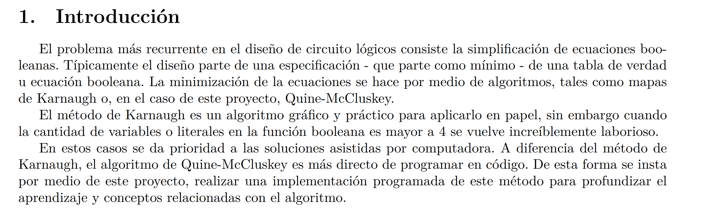
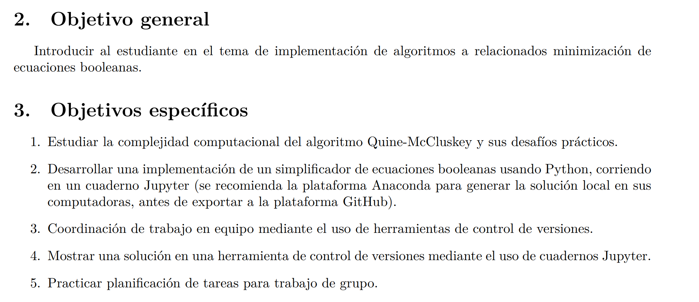
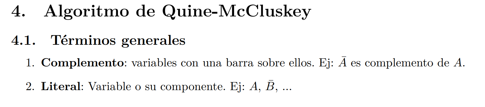
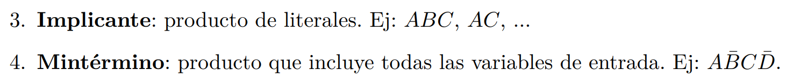
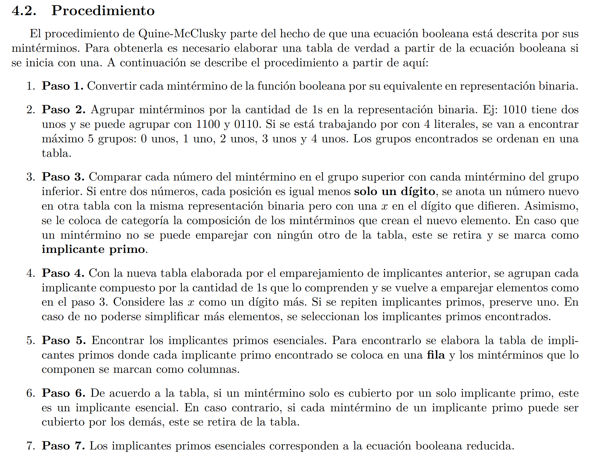
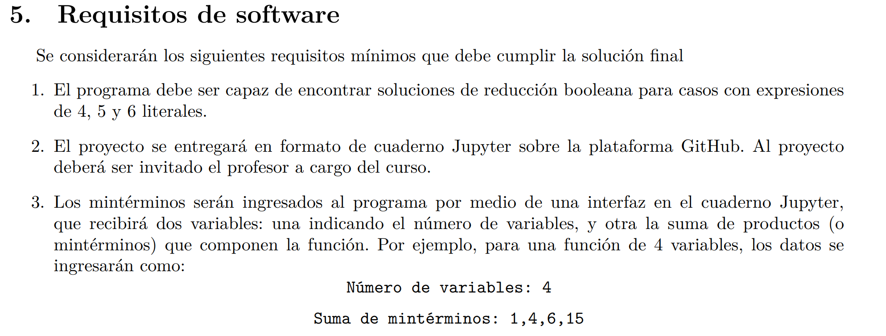
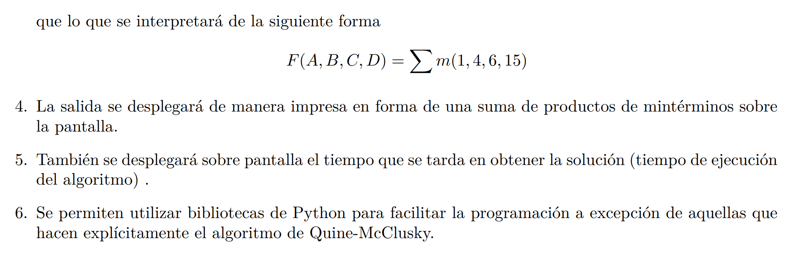
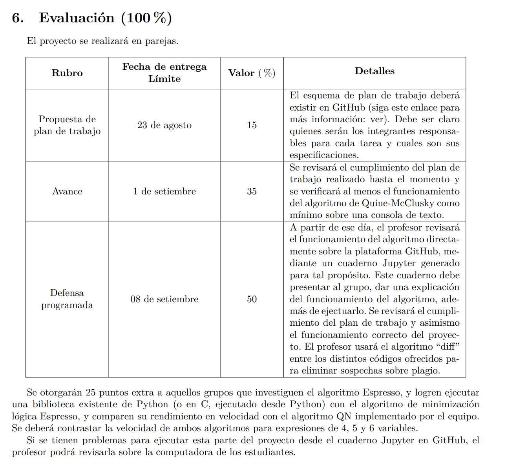

# Hola este un proyecto de Diseño Lógico

Se desarrollará el algoritmo de Mc Cluskey. A través de un cuaderno de Jupyter.


# Integrantes 
- Carlos Andrés Mata Calderón (2019033834)
- Jesús Soto Benavides

# ¿Cómo correr el proyecto?

## Pre-Requisitos

- Tener instaldo python 3
- Tener descargado las siguientes librerias


```commandline
pip install notebook
```


> ~~pip install pyeda~~

 
# Donde
Abre el arhivo llamado ``main.ipynb``. 

Dentro el arhivo abrá un apartado deEn el apartado **Inciar programa**.
Además existe un apartado de **Testing**. En dicho apartado
se encuentra las pruebas de los algoritmos con el fin de verificar el 
funcionamiento.

# Enunciado








 

# Referencias Originales

[1] Felipe Santiago Espinoza. Video demostrativo del algoritmo de Quine-McCluskey. url: https://www.outube.com/watch?v=DTOzK88Inkk.

[2] Donald Krambeck. Everything About the Quine-McCluskey Method - technical articles. url: https://www.allaboutcircuits.com/technical-articles/everything-about-the-quine-mccluskeymethod/.

[3] Donald Krambeck. Prime implicant simplification using Petrick’s method - technical articles. url:https://www.allaboutcircuits.com/technical-articles/prime-implicant-simplificationusing-petricks-method/.

[4] E. J. McCluskey. «Minimization of Boolean functions». En: The Bell System Technical Journal 35.6
(1956), págs. 1417-1444. doi: 10.1002/j.1538-7305.1956.tb03835.x.

[5] Wikipedia. Algoritmo Quine–McCluskey. url: https://es.wikipedia.org/wiki/Algoritmo_Quine%
E2%80%93McCluskey.

# Referencias
- [Simplificador de funciones booleanas](http://tma.main.jp/logic/index_en.html)
- [Num binarios en python](https://www.w3schools.com/python/ref_func_bin.asp#:~:text=The%20bin()%20function%20returns,start%20with%20the%20prefix%200b%20.)
- [Padding (Relleno) en los numeros binarios en python)](https://stackoverflow.com/questions/16926130/convert-to-binary-and-keep-leading-zeros)
- [Realizar hint (agregar tipo) a las variables de python](https://docs.python.org/3/library/typing.html)
- [Vertical Selection JetBrains IDEs](https://georgik.rocks/intellij-idea-vertical-text-block-selection/)
- [Markdown Syntax](https://gist.github.com/cuonggt/9b7d08a597b167299f0d)
- [Ordena numero por cantidad de 1's](https://www.tutorialspoint.com/program-to-sort-numbers-based-on-1-count-in-their-binary-representation-in-python)
- [Bint to int](https://stackoverflow.com/questions/8928240/convert-base-2-binary-number-string-to-int)
- [Count in Python](https://www.w3schools.com/python/ref_list_count.asp)
- [Lambda en Python](https://www.w3schools.com/python/python_lambda.asp)
- [Do while en Python](https://realpython.com/python-do-while/)
- [Funcion como parametro](https://es.stackoverflow.com/questions/139223/se-puede-pasar-una-funci%C3%B3n-como-par%C3%A1metro-en-python)
- [Calcular tiempo de funciones](https://www.youtube.com/watch?v=bWvcdypQCcs)
- [Ejemplo C++](https://github.com/AkshayRaman/Quine-McCluskey-algorithm)
